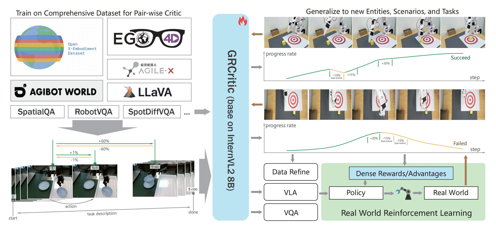

# GRCritic: General Pair-wise Critic Model for Real World Embodied RL
<div align="center">

**Language**: [English](README.md) | [中文](README_CN.md)

</div>

## 🚀 Interactive Demo & Homepage

<div align="center">

### [🎮 **Try Interactive & Homepage**](https://c99de865b42aff6577.gradio.live)
> **Online Demo is available now in Homepage, Try as you like!!!**

</div>

> **📅 The model and report will be open-sourced in August**
<div align="center">
  
</div>

## GRCritic

GRCritic is a general-purpose pair-wise critic model designed for real world embodied reinforcement learning tasks. It provides robust evaluation capabilities for trajectory assessment and task completion verification.

GRCritic trained on **3000h+** human data, **1200h+** comprehensive public robotic manipulation data, and **15h+** self-collected manipulation data. Available in 2b and 8b versions.

## ✨ Key Features

• **Pair-wise comparison mechanism** for improved progressing dense critic accuracy, better recognition of state changes, and each step can be the start of the trajectory.

• **Multi-modal capabilities** - Supports process tracking, task completion judgment, task description estimation, visual question answering, and even embodied action output, equipped with VLA capabilities.

• **Flexible zero-shot and one-shot** - in-context capabilities, maintaining excellent performance across entities, scenarios, and tasks.

• **Human-task synesthesia** - Based on the ego4D human dataset, model understands common tasks and build synesthesia for real-world human tasks and embodied tasks.

• **Trajectory quality screening** - GRCritic evaluates the collected trajectories and filters out low score trajectories based on the VOC value, that is, data with low fluency and quality, improving the effect and efficiency of imitation learning.

## Framework

<div align="center">
  
</div>

*GRCritic is trained on a combination of comprehensive public robotic manipulation datasets, human demonstration data, self-collected manipulation data, and various image understanding datasets. Video data is processed into pairwise samples to learn the differences between any two states, supplemented with task descriptions to enable task completion evaluation and action output, as illustrated in the bottom-left corner. The model demonstrates strong generalization capabilities to entities, scenarios, and tasks not covered in the training set. It evaluates task progress and actions, providing dense Critic feedback for real-world reinforcement learning and offering guidance for data refinement. Additionally, the model can function as a Vision-Language-Action (VLA) system to directly perform manipulation tasks, exhibiting zero-shot capabilities to handle new, unseen tasks in different scenarios, as shown in the diagram on the right.*

## Performance

Details about the model's performance and evaluation metrics can be found in the Homepage.

## Quick Start

> **📅 The model and report will be open-sourced in August**

## Citation

```bibtex
@article{grcritic2025,
  title={GRCritic: General Pair-wise Critic Model for Real World Embodied Reinforcement Learning},
  author={Shanghai AI lab},
  year={2025},
  note={Paper coming soon}
}

